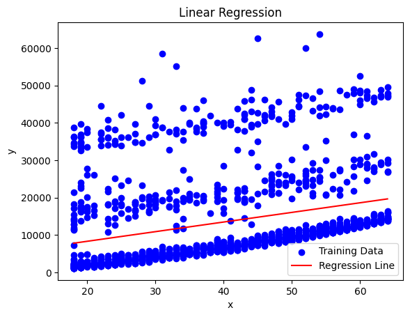

# GitHub Codespaces ♥️ Jupyter Notebooks
**Implement the Linear Regression algorithm from scratch in Python using Numpy and Pandas and Matplotlib for visualization**
 
With Medical_Price_Dataset.csv  
 index  age   sex     bmi     children smoker  region      charges
 0      19  female  27.900         0    yes  southwest  16884.92400
 1      18    male  33.770         1     no  southeast   1725.55230
 2      28    male  33.000         3     no  southeast   4449.46200
 3      33    male  22.705         0     no  northwest  21984.47061
 4      32    male  28.880         0     no  northwest   3866.85520
 ...   ...     ...     ...       ...    ...        ...          ...
 1333   50    male  30.970         3     no  northwest  10600.54830
 1334   18  female  31.920         0     no  northeast   2205.98080
 1335   18  female  36.850         0     no  southeast   1629.83350
 1336   21  female  25.800         0     no  southwest   2007.94500
 1337   61  female  29.070         0    yes  northwest  29141.36030
 
[1338 rows x 7 columns]>

